# Facebook

A Facebook clone app built using the **MVVM pattern** with **Riverpod**, featuring core functionalities like real-time chat, friend requests, and authentication.

## Features

- Chat with Friends: Real-time messaging to stay connected.
- Friend Requests: Send, accept, or decline requests.
- Post Images and Videos: Share photos and videos with friends.
- Post Stories: Share temporary content that expires after 24 hours.
- Likes and Comments: Engage with posts by liking and commenting.
- Create Account: Sign up with email and password.
- Firebase Authentication: Secure login and registration.

## Screenshots

  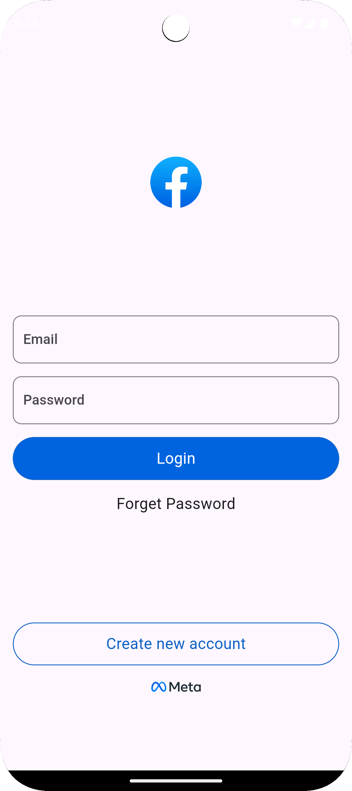
  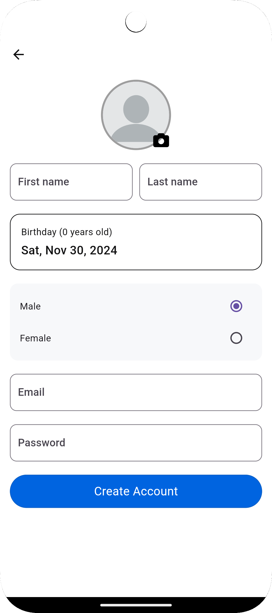
  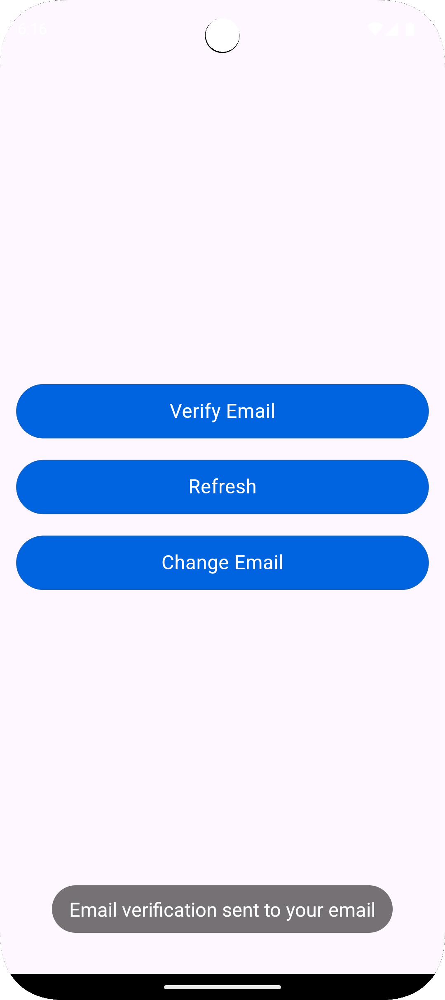
  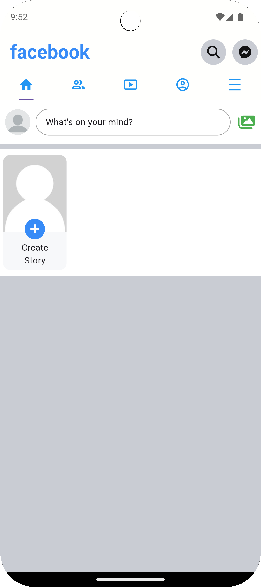
  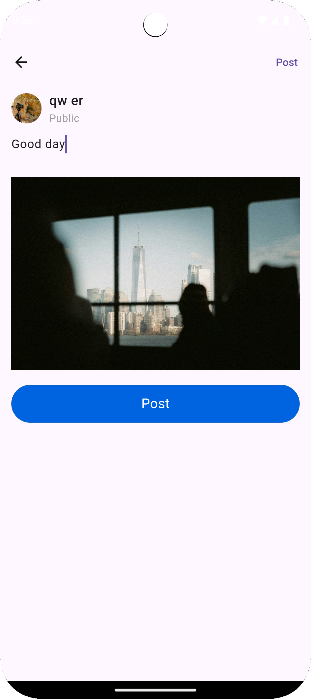
  
  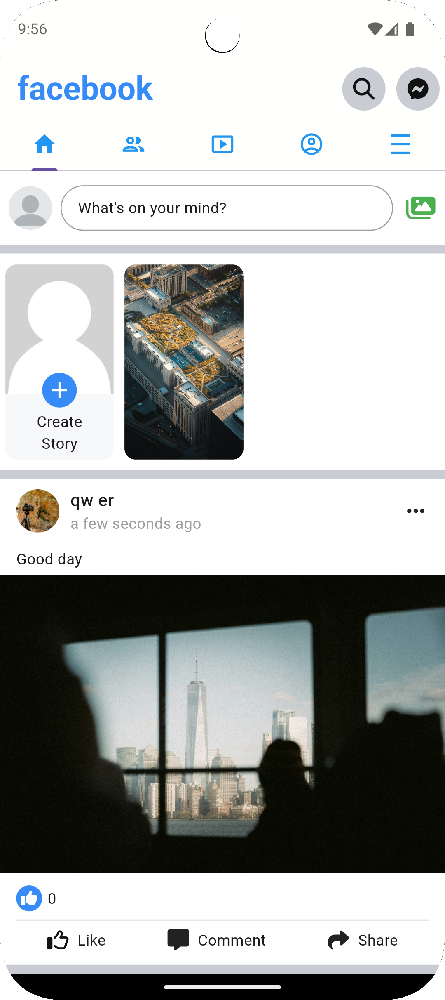
  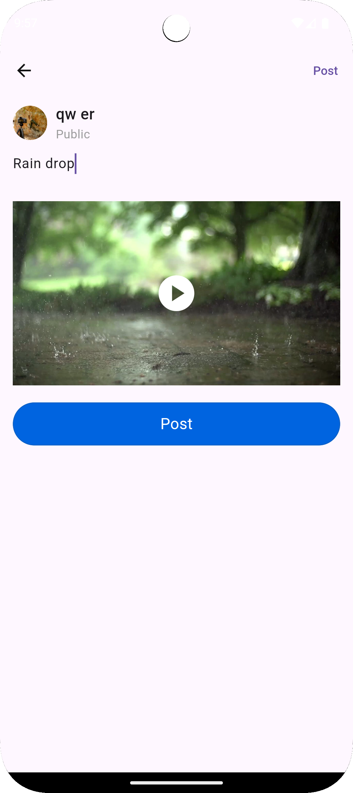
  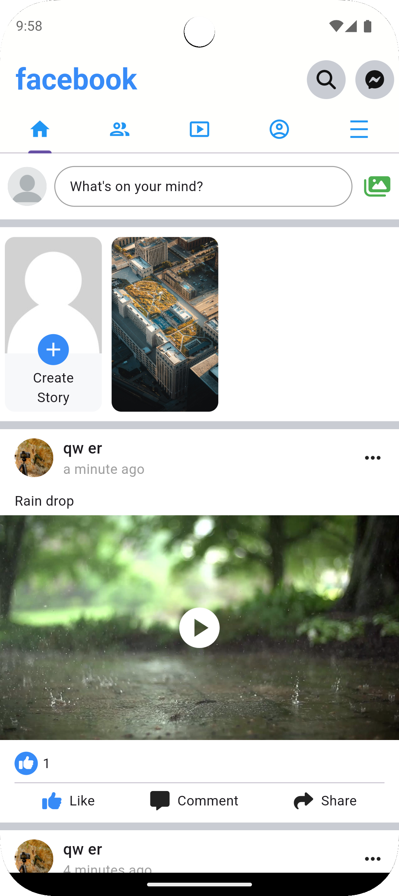
  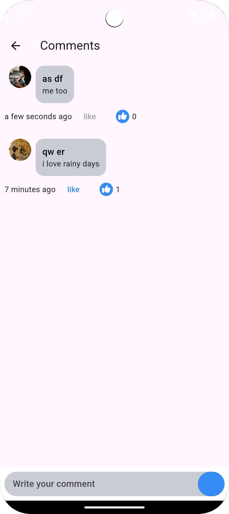
  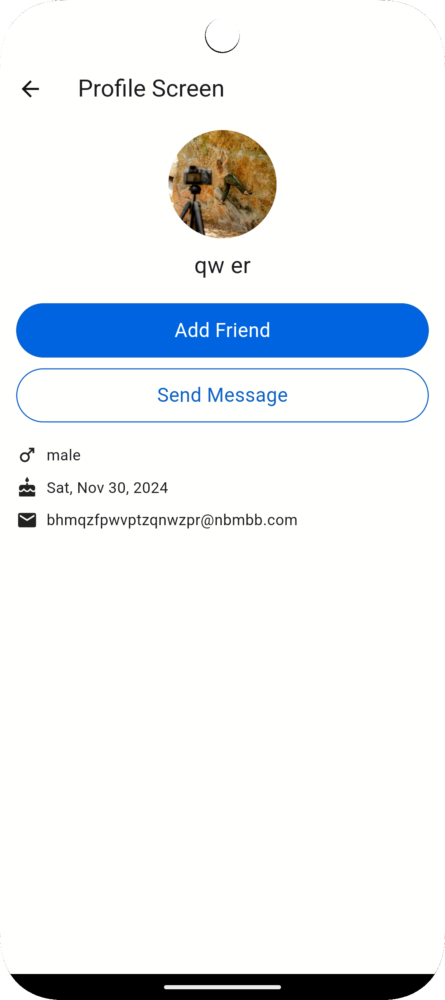
  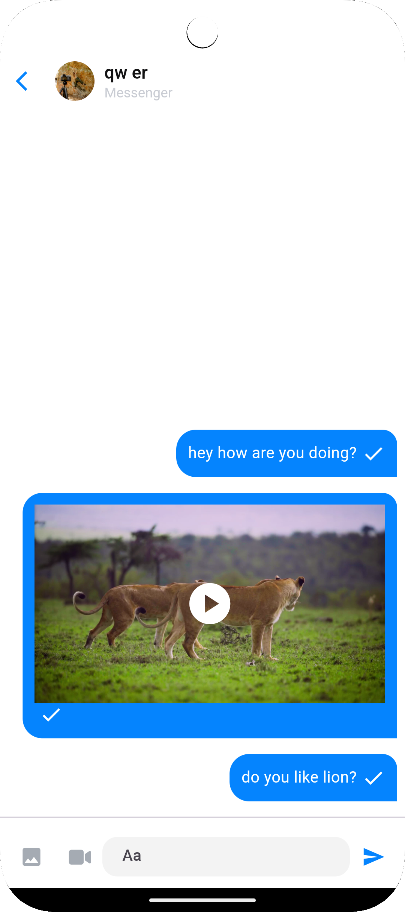
  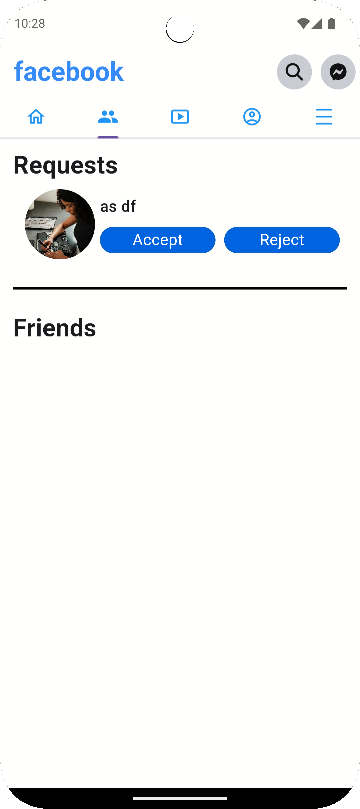
  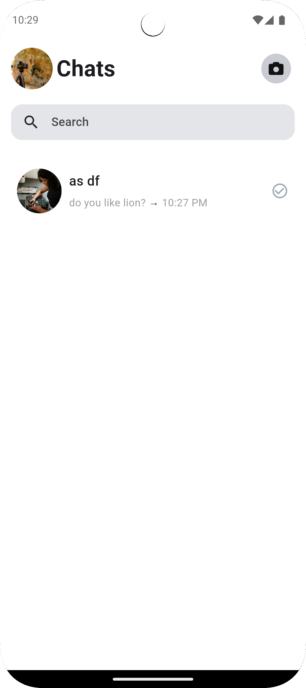
  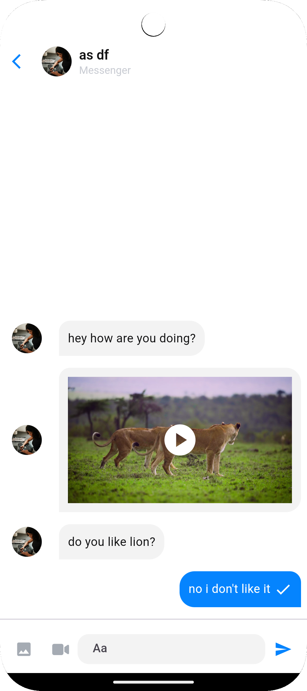

